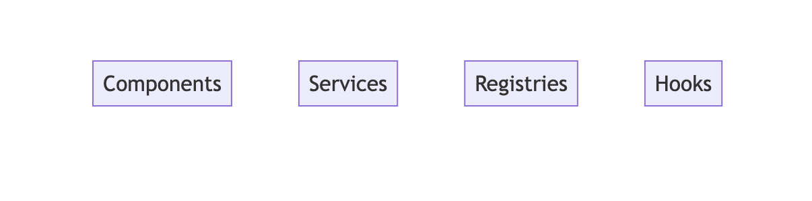
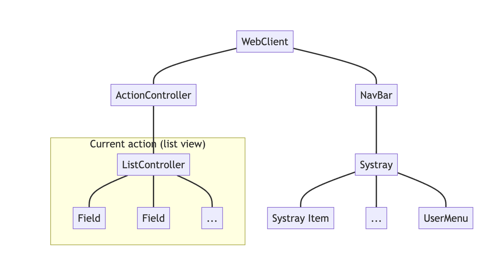
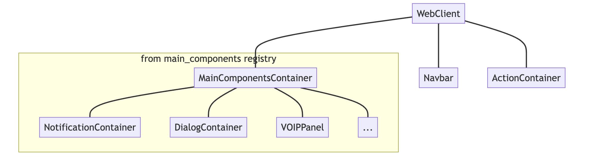

# Notes: Architecture
# 笔记: 架构

Let us discuss here how Odoo javascript code is designed. Roughly speaking,
all features are made with a combination of components, services, registries,
hooks or helper/utility functions.
本文将讨论 Odoo JavaScript 代码的设计方式。简单来说，所有功能都是通过组件、服务、注册表、钩子或辅助/实用函数的组合来实现的。



## Component Tree
## 组件树

From a very high level stand point, the javascript code defines a (dynamic) tree
of components. For example, with an active list view, it might look like this:
从非常高的层面上看，JavaScript 代码定义了一棵（动态的）组件树。例如，在一个活动的列表视图中，它可能看起来像这样：



In this case, if the user clicks on a record, it may open a form view, and the
content of the current action would be replaced with a form view. The, switching
a notebook tab would destroy the content of the previous tab, and render the
new content.
在这种情况下，如果用户点击一条记录，它可能会打开一个表单视图，并且当前操作的内容将被表单视图替换。然后，切换笔记选项卡将销毁先前选项卡的内容，并渲染新的内容。

This is how Owl applications work: the visible components are displayed, updated,
and replaced with other components, depending on the user actions.
这就是 Owl 应用程序的工作方式：可见的组件会根据用户操作进行显示、更新和替换。

## Services
## 服务

Documentation: [services](https://www.odoo.com/documentation/master/developer/reference/frontend/services.html)

In practice, every component (except the root component) may be destroyed at
any time and replaced (or not) with another component. This means that each
component internal state is not persistent. This is fine in many cases, but there
certainly are situations where we want to keep some data around. For example,
all discuss messages, or the current menu.
实际上，每个组件（根组件除外）都可能随时被销毁并替换（或不替换）为另一个组件。这意味着每个组件的内部状态都是不持久的。在很多情况下，这都没有问题，但肯定有一些情况下，我们希望保留一些数据。例如，所有讨论消息或当前菜单。

Also, it may happen that we need to write some code that is not a component.
Maybe something that process all barcodes, or that manages the user configuration
(context, ...).
此外，我们可能需要编写一些不是组件的代码。也许是处理所有条形码的代码，或者管理用户配置（上下文等）的代码。

The Odoo framework defines the notion of `service`, which is a persistent piece
of code that exports state and/or functions. Each service can depend on other
services, and components can import a service.
Odoo 框架定义了 `service` 的概念，它是一段持久的代码，导出状态和/或函数。每个服务都可以依赖其他服务，组件可以导入服务。

The following example registers a simple service that displays a notification every 5 seconds:
以下示例注册了一个简单的服务，每 5 秒显示一次通知：

```js
import { registry } from "@web/core/registry";

const myService = {
  dependencies: ["notification"],
  start(env, { notification }) {
    let counter = 1;
    setInterval(() => {
      notification.add(`Tick Tock ${counter++}`);
    }, 5000);
  },
};

registry.category("services").add("myService", myService);
```

Note that services are registered in a `registry`. See below for more on that.
请注意，服务是在 `registry` 中注册的。关于这方面的内容将在下面详细介绍。

Services can be accessed by any component. Imagine that we have a service to
maintain some shared state:
任何组件都可以访问服务。想象一下我们有一个服务来维护一些共享状态：

```js
import { registry } from "@web/core/registry";

const sharedStateService = {
  start(env) {
    let state = {};

    return {
      getValue(key) {
        return state[key];
      },
      setValue(key, value) {
        state[key] = value;
      },
    };
  },
};

registry.category("services").add("shared_state", sharedStateService);
```

Then, any component can do this:
然后，任何组件里都可以像这样写：

```js
import { useService } from "@web/core/utils/hooks";

setup() {
    this.sharedState = useService("shared_state");
    const value = this.sharedState.getValue("somekey");
    // do something with value
}
```

## Registries
## 注册表

Documentation: [registries](https://www.odoo.com/documentation/master/developer/reference/frontend/registries.html)

Registries are central to the code architecture: they maintain a collection of
key/value pairs, that are used in many places to read some information. This is
the main way to extend or customize the web client.
注册表是代码架构的核心：它们维护着一组键值对，这些键值对在很多地方用于读取信息。这是扩展或定制 Web 客户端的主要方式。

For example, a common usecase is to register a field or a view in a registry,
then add the information in a view arch xml, so the web client will know what
it should use.
例如，一个常见的用例是在注册表中注册一个字段或视图，然后在视图架构 XML 中添加信息，以便 Web 客户端知道应该使用什么。

But fields and views are only two usecases. There are many situations where we
decides to go with a registry, because it makes it easy to extend. For example,
但是，字段和视图只是两个用例。在很多情况下，我们会选择使用注册表，是因为它可以轻松扩展。例如：

- service registry
- field registry
- user menu registry
- effect registry
- systray registry
- ...

## Extending/Customizing Odoo JS Code
## 扩展/定制 Odoo JS 代码

As seen above, registries are really the most robust extension point of Odoo JS
code. They provide an official API, and are designed to be used. So, one can
do a lot of things with just registries, by adding and/or replacing values.
如上所述，注册表实际上是 Odoo JS 代码最强大的扩展点。它们提供了一个官方 API，并且旨在被使用。因此，只需通过添加或替换值，就可以用注册表完成很多事情。

Another less robust way of customizing the web client is by monkey patching a
component and/or class.
另一种不太强大的定制 Web 客户端的方法是对组件和/或类进行猴子补丁。

Documentation: [patching code](https://www.odoo.com/documentation/master/developer/reference/frontend/patching_code.html)

This is totally okay if there are no other way to do it, but you should be aware
that this is less robust: any change in the patched code may break the customizing,
even if it is just a function rename!
如果别无他法，这样做完全可以，但是要注意，这种方法不太健壮：补丁代码的任何更改都可能破坏定制，即使只是重命名函数！

## Example: the main component registry
## 示例：主组件注册表

A very common need is to add some components as a direct child of the root component.
This is how some features are done:
一个非常常见的需求是将一些组件作为根组件的直接子组件添加。以下是一些功能的实现方式：

- notifications: we need a container component to render all active notifications
- 通知：我们需要一个容器组件来渲染所有活动的通知
- discuss: need a container component to add all discuss chat window
- 讨论：我们需要一个容器组件来添加所有讨论聊天窗口
- voip: need the possibility to open/close a dialing panel on top of the UI
- VoIP：我们需要能够在 UI 的顶部打开/关闭拨号面板

To make it easy, the web client is actually looking into a special registry, `main_components`,
to determine which component should be rendered. This is done by the `MainComponentsContainer`
component, which basically performs a `t-foreach` on each key in that registry.
为了简化操作，Web 客户端实际上会查看一个特殊的注册表 `main_components`，以确定应该渲染哪些组件。这是由 `MainComponentsContainer` 组件完成的，该组件基本上对注册表中的每个键执行 `t-foreach`。



Adding a component to that list is as simple as subscribing to the `main_components`
registry. Also, remember that the template of a component can look like this:
将组件添加到该列表与订阅 `main_components` 注册表一样简单。此外，请记住，组件的模板可能看起来像这样：

```xml
<t t-name="mytemplate">
    <t t-if="some condition">
        some content here
    </t>
</t>
```

So, your component may be empty until some condition happens.
因此，您的组件可能会为空，直到某个条件发生。

## Example: the notification system
## 示例：通知系统

Often, we can think of a feature as a combination of the blocks above. Let us
see for example how the notification system can be designed. We have:
通常，我们可以将一个功能视为上述模块的组合。例如，让我们看看通知系统是如何设计的。我们有：

- a `Notification` component, which receive some props and renders a notification
- 一个 `Notification` 组件，它接收一些属性并渲染一个通知
- a `notification` service, which exports a reactive list of active notifications, and
  a few methods to manipulate them (add/close)
- 一个 `notification` 服务，它导出一个活动的通知的响应列表，以及一些用于操作它们的函数（添加/关闭）  
- a `NotificationContainer`, which subscribe to the `notification` service, and
  render them with a `t-foreach` loop.
- 一个 `NotificationContainer`，它订阅 `notification` 服务，并使用 `t-foreach` 循环渲染它们。

With that system, code anywhere in Odoo can uses the `notification` service to
add/close a notification. This will cause an update to the internal list of
notification, which will in turn trigger a render by the `NotificationContainer`.
有了这个系统，Odoo 中任何地方的代码都可以使用 `notification` 服务来添加/关闭通知。这将导致内部通知列表的更新，进而触发 `NotificationContainer` 的渲染。
