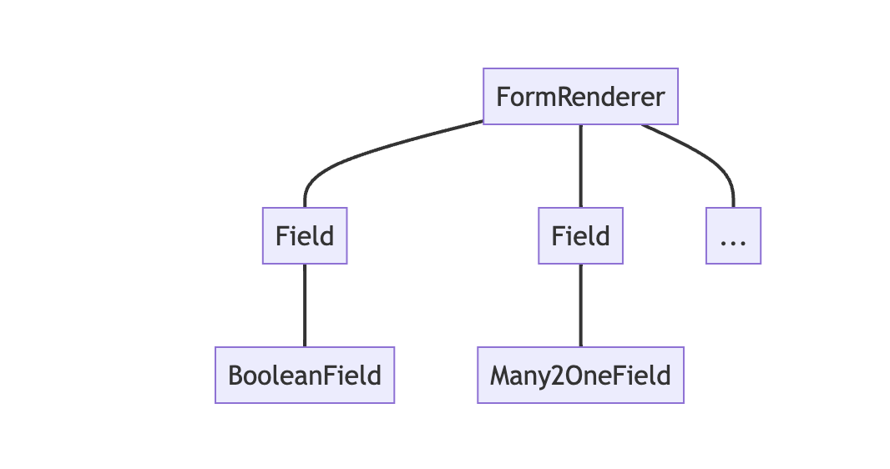

# Notes: Fields
# 笔记：字段

In the context of the javascript framework, fields are components specialized for
visualizing/editing a specific field for a given record.
在 JavaScript 框架的背景下，字段是专门用于可视化/编辑给定记录的特定字段的组件。

For example, a (python) model may define a boolean field, which will be represented
by a field component `BooleanField`.
例如，一个（Python）模型可以定义一个布尔字段，它将由一个字段组件 `BooleanField` 表示。

Usually, fields can display data in `readonly` or in `edit` mode. Also, they are
often specific to a field type: `boolean`, `float`, `many2one`, ...
通常，字段可以在 `readonly` 或 `edit` 模式下显示数据。此外，它们通常特定于字段类型：`boolean`、`float`、`many2one` 等。

Fields have to be registered in the `fields` registry. Once it's done, they can
be used in some views (namely: `form`, `list`, `kanban`) by using the `widget`
attribute:
字段必须在 `fields` 注册表中注册。完成注册后，它们可以通过使用 `widget` 属性在一些视图（即 `form`、`list`、`kanban`）中使用：

```xml
    <field name="preview_moves" widget="account_resequence_widget"/>
```

Note that fields may in some case be used outside the context of a view.
请注意，字段在某些情况下可能在视图之外使用。

## Generic Field Component
## 通用字段组件

Just like concrete views are designed to be created by a generic `View` component,
concrete fields are also designed to be created by a generic component, `Field`.
就像具体视图被设计为由通用 `View` 组件创建一样，具体字段也是为了由通用组件 `Field` 创建而设计的。

For example:
例如：

```xml
<Field
    name="field.name"
    record="props.record"
    type="field.widget"
    readonly="true"
    fieldInfo="props.fieldNodes[field.name]"/>
```

This example show some of the props accepted by the `Field` component. Then, it
will make sure it loads the correct component from the `fields` registry, prepare
the base props, and create its child. Note that the `Field` component is _dom less_:
it only exists as a wrapper for the concrete field instance.
这个例子展示了 `Field` 组件接受的一些属性。然后，它将确保从 `fields` 注册表中加载正确的组件，准备基本属性，并创建它的子组件。请注意，`Field` 组件是 _dom-less_ 的：它只作为具体字段实例的包装器存在。

Here is what it look like for the form view:
以下是它在表单视图中的样子：



## Defining a field component
## 定义一个字段组件

A field component is basically just a component registered in the `fields` registry.
It may define some additional static keys (metadata), such as `displayName` or `supportedTypes`,
and the most important one: `extractProps`, which prepare the base props received
by the `CharField`.
字段组件基本上只是一个在 `fields` 注册表中注册的组件。它可能定义一些额外的静态键（元数据），例如 `displayName` 或 `supportedTypes`，以及最重要的一个：`extractProps`，它准备 `CharField` 收到的基本属性。

Let us discuss a (simplified) implementation of a `CharField`:
让我们讨论一个（简化的）`CharField` 的实现：

First, here is the template:
首先，这是模板：

```xml
    <t t-name="web.CharField" owl="1">
        <t t-if="props.readonly">
            <span t-esc="formattedValue" />
        </t>
        <t t-else="">
            <input
                class="o_input"
                t-att-type="props.isPassword ? 'password' : 'text'"
                t-att-placeholder="props.placeholder"
                t-on-change="updateValue"
            />
        </t>
    </t>
```

It features a readonly mode, an edit mode, which is an input with a few attributes.
Now, here is the code:
它具有只读模式和编辑模式，编辑模式是一个带有几个属性的输入。现在，这是代码：

```js
export class CharField extends Component {
  get formattedValue() {
    return formatChar(this.props.value, { isPassword: this.props.isPassword });
  }

  updateValue(ev) {
    let value = ev.target.value;
    if (this.props.shouldTrim) {
      value = value.trim();
    }
    this.props.update(value);
  }
}

CharField.template = "web.CharField";
CharField.displayName = _lt("Text");
CharField.supportedTypes = ["char"];

CharField.extractProps = ({ attrs, field }) => {
  return {
    shouldTrim: field.trim && !archParseBoolean(attrs.password),
    maxLength: field.size,
    isPassword: archParseBoolean(attrs.password),
    placeholder: attrs.placeholder,
  };
};

registry.category("fields").add("char", CharField);
```

There are a few important things to notice:
有一些重要的事情需要注意：

- the `CharField` receives its (raw) value in props. It needs to format it before displaying it
- `CharField` 在属性中接收它的（原始）值。它需要在显示之前对它进行格式化。
- it receives a `update` function in its props, which is used by the field to notify
  the owner of the state that the value of this field has been changed. Note that
  the field does not (and should not) maintain a local state with its value. Whenever
  the change has been applied, it will come back (possibly after an onchange) by the
  way of the props.
- 它在属性中接收一个 `update` 函数，该函数用于字段通知状态的所有者，该字段的值已更改。请注意，该字段不会（也不应该）使用其值维护本地状态。只要更改已应用，它将通过属性（可能在 `onchange` 之后）返回。
- it defines an `extractProps` function. This is a step that translates generic
  standard props, specific to a view, to specialized props, useful to the component.
  This allows the component to have a better API, and may make it so that it is
  reusable.
- 它定义了一个 `extractProps` 函数。这是一个将特定于视图的通用标准属性转换为对组件有用的专门属性的步骤。这允许组件具有更好的 API，并且可能使其可以重用。

Note that the exact API for fields is not really documented anywhere.
请注意，字段的精确 API 实际上没有在任何地方记录过。