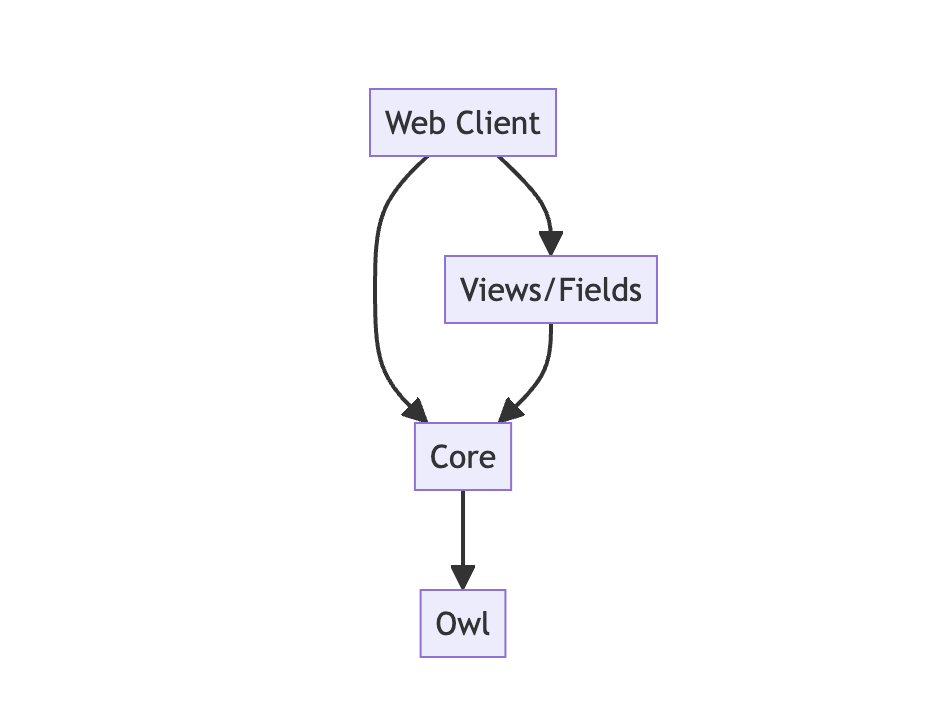

# Notes: The Odoo Javascript Ecosystem
# 笔记：Odoo JavaScript 生态系统

A quick overview
快速概述

## Historical context
## 历史背景

First web client was in Odoo v6.1 (port of a gtk application). Back then,
not many large web applications, so Odoo (then openERP) was built with jquery
and a custom framework (mostly a Class and a Widget implementation). Remember
that it was before Ecmascript 6 (so no class in JS), before bootstrap, before
a lot of the current web technologies.

第一个 Web 客户端出现在 Odoo v6.1 中（从一个 GTK 应用程序移植而来）。当时，大型 Web 应用程序并不多，所以 Odoo（当时称为 openERP）是用 jQuery 和一个自定义框架（主要是 Class 和 Widget 实现）构建的。请记住，这发生在 Ecmascript 6 之前（所以 JS 中没有类），在 Bootstrap 之前，在很多当前流行的 Web 技术之前。

Then it evolved randomly in a lot of directions. A module system was added in
2014 (maybe some of you will remember `odoo.define(...)`), then the code had to
be improved for the new views, for studio. The complexity of the application
increased a lot, code was getting more structured also.

然后它在很多方向上随机发展。2014 年添加了一个模块系统（也许有些人还记得 `odoo.define(...)`），然后代码需要针对新的视图进行改进，以便支持 Studio。应用程序的复杂性大幅增加，代码也变得更有条理。

Then came the need to move to a more modern/productive framework. The Widget system
(based on imperative principles) was not a good bet for the future. Odoo invested
in its own framework (Owl, released in 2019), which is now the basis for the odoo
web client.

然后出现了迁移到更现代/更高效框架的必要性。Widget 系统（基于命令式原则）并不适合未来。Odoo 投资开发了自己的框架（Owl，于 2019 年发布，声明式），它现在是 Odoo Web 客户端的基础。

2019-2022 has seen a huge amount of work in Odoo JS: the assets system was
modernized (ES6 modules), the codebase was refactored, based on modern architecture
and principles. It involved basically a complete rewrite using owl, services,
registries, components, hooks.

2019 年至 2022 年，Odoo JS 进行了大量的改进：资产系统得到了现代化改造（ES6 模块），代码库进行了重构，基于现代架构和原则。它基本上涉及使用 Owl、服务、注册表、组件、钩子进行完全重写。

## Odoo 16: A new Era
## Odoo 16：一个新纪元

The v16 is the beginning of a (mostly) completely new codebase. Here is a short
list of most significant changes, in no particular order:

v16 是一个（几乎）完全重写的代码库的第一个版本。以下是最重要的更改列表，没有特定顺序：

- most of the UI is composed of `Owl` components
- 大多数 UI 由 `Owl` 组件构成。
- the new code does not use `jquery` anymore (we plan to remove jquery from our assets in the future)
- 新代码不再使用 `jquery`（我们计划将来从资产中删除 jquery）。
- the `moment` library has been replaced by `luxon` (to manipulate date/datetime)
- `moment` 库已被 `luxon` 替换（用于操作日期/时间）。
- we now use `bootstrap` 5, but only the layout and css (not using the js code if possible)
- 我们现在使用 `bootstrap` 5，但仅使用布局和 CSS（尽可能不使用 JS 代码）。
- with Owl, we don't need to add much css classes (it was necessary before to target event handlers, but can
  now be done with `t-on-click` in templates)
- 使用 Owl，我们不需要添加太多 CSS 类（以前需要针对事件处理程序（使用很多css），但现在可以使用模板中的 `t-on-click`）。  
- assets (js/css/xml) are now declared in the manifest, can be easily split in
  bundles, and js files can use ES6 syntax
- 资产（js/css/xml）现在在清单文件中声明，可以轻松地拆分成捆绑包，并且 JS 文件可以使用 ES6 语法。  
- code is now organized by feature, not by type. So, we no longer have folders like
  `css`, `js`, `xml`. Instead, we organize files and folders according to their
  function (`reporting`, `notifications`, ...)
- 代码现在按功能组织，而不是按类型组织。因此，我们不再有像 `css`、`js`、`xml` 这样的文件夹。相反，我们根据功能（`reporting`、`notifications` 等）组织文件和文件夹。

## Backend or frontend?
## 后端还是前端？

Roughly speaking, Odoo has 3 main javascript codebases:

粗略地说，Odoo 有三个主要的 JavaScript 代码库：


- the website (public, also known in odoo as the `frontend`)
- 网站（公共的，在 Odoo 中也称为 `frontend`）
- the webclient (private, also known as the `backend` (to be avoided, since it is confusing))
- Web 客户端（私有的，也称为 `backend`（应该避免使用，因为会造成混淆））
- the point of sale
- 销售点

The website is a classical MPA (Multi Page Application). Each page is rendered
by the server. It will load some javascript to add a touch of life to the UI.

网站是一个经典的 MPA（多页面应用程序）。每个页面都由服务器渲染。它将加载一些 JavaScript 来为 UI 添加一些活力。

The webclient and the point of sale are SPA (Single Page Application). The (only)
page is rendered by the browser. It will then loads data from the server, as
needed, and update the page without reloading the page.

Web 客户端和销售点是 SPA（单页面应用程序）。该单页面由浏览器渲染。它将根据需要从服务器加载数据，并更新页面，而无需重新加载页面。

Since they are based on very different principles, the code of website is very
different from the code of the web client/point of sale (even though they share
some code, mostly in `addons/web/static/src/core`). This training will be
more focused on the SPA aspect of Odoo.

由于它们基于非常不同的原则，网站的代码与 Web 客户端/销售点的代码有很大不同（尽管它们共享一些代码，主要是在 `addons/web/static/src/core` 中）。本培训将更多地关注 Odoo 的 SPA 方面。

## The different layers of Odoo Javascript in Odoo
## Odoo 中 Odoo JavaScript 的不同层级

One can think of the Odoo web client as being built with four layers:

可以将 Odoo Web 客户端视为由四个层级构建：



- `web client`: it is the presentation layer that describes the
  user interface (navbar, action system, ...)
- `web client`：它是一个表示层，描述用户界面（导航栏、动作系统等）。  
- `views and fields`: all the code that describes how to visualize and interact with data
  from the database, such as the form view, the list view or the kanban view.
- `views and fields`：所有描述如何可视化和与数据库中的数据交互的代码，例如表单视图、列表视图或看板视图。  
- `core`: it is the layer that defines the basic building blocks
  for an odoo application. Things such as `registries`, `services`, helpers,
  python engine, generic components.
- `core`：它是一个定义 Odoo 应用程序基本构建块的层。例如 `registries`、`services`、辅助函数、Python 引擎、通用组件。  
- `owl`: the low level component system. It defines the basic
  primitives for writing UI code, such as the Component or the `reactive` function.
- `owl`：低级组件系统。它定义编写 UI 代码的基本原语，例如组件或 `reactive` 函数。

## Folder structure
## 文件夹结构

Most of the time, javascript (and other assets) code should be structured like
this:

大多数情况下，JavaScript（和其他资产）代码应该按以下结构组织：

```
/static/
    src/
        notifications/
            notification_service.js
            notification.js
            notification.xml
            notification.scss
        some_component.js
        some_component.xml
        ...
    tests/
        helpers.js
        notification_tests.js
        ...
```

Note that we don't have the `js/`, `scss`, or `xml` folder anymore. Code is
grouped by concern. Tests should be located in a `static/tests` folder.

请注意，我们不再有 `js/`、`scss` 或 `xml` 文件夹。代码按关注点分组。测试应该位于 `static/tests` 文件夹中。


