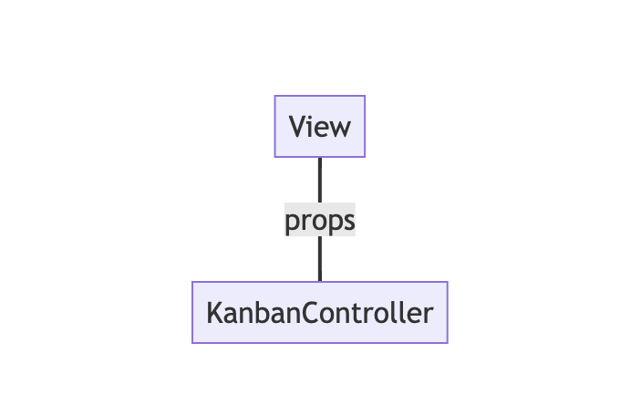
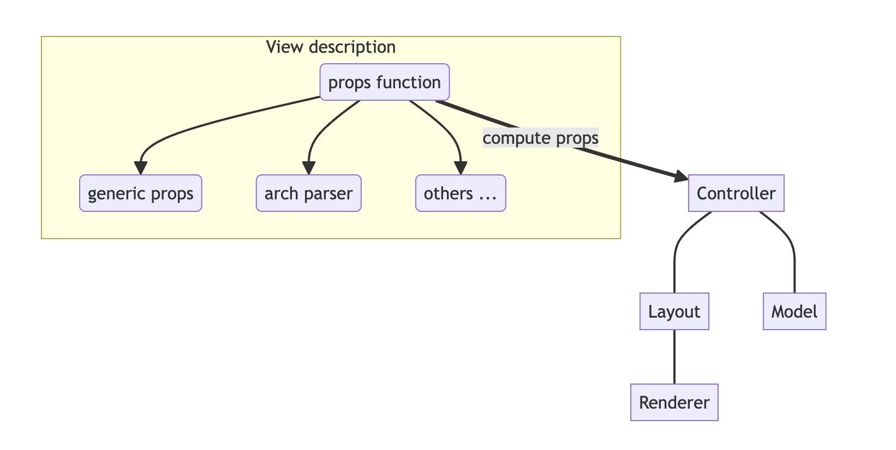

# Notes: Views
# 笔记：视图

Views are among the most important components in Odoo: they allow users to interact
with their data. Let us discuss how Odoo views are designed.

视图是 Odoo 中最重要的组件之一：它们允许用户与其数据交互。让我们讨论一下 Odoo 视图的设计方式。

The power of Odoo views is that they declare how a particular screen should work,
with a xml document (usually named `arch`, short for `architecture`). This description
can be extended/modified by xpaths serverside. Then the browser will load that
document, parse it (fancy word to say that it will extract the useful information),
then represent the data accordingly.

Odoo 视图的强大之处在于，它们使用 XML 文档（通常命名为 `arch`，代表 `architecture`）来声明特定界面的工作方式。这种描述可以在服务器端通过 XPath 扩展/修改。然后，浏览器将加载该文档，解析它（解析的意思是提取有用信息），然后相应地表示数据。

The `arch` document is view specific. For example, here is how a `graph` view
or a `calendar` view could be defined:

`arch` 文档是特定于视图的。例如，以下是如何定义 `graph` 视图或 `calendar` 视图：

```xml
  <graph string="Invoices Analysis" type="line" sample="1">
      <field name="product_categ_id"/>
      <field name="price_subtotal" type="measure"/>
  </graph>

  <calendar string="Leads Generation" create="0" mode="month" date_start="activity_date_deadline" color="user_id" hide_time="true" event_limit="5">
    <field name="expected_revenue"/>
    <field name="partner_id" avatar_field="avatar_128"/>
    <field name="user_id" filters="1" invisible="1"/>
</calendar>
```

## The generic `View` component
## 泛型 `View` 组件

Most of the time, views are created with the help of a generic `View` component,
located in `@web/views/view`. For example, here is what it look like for a kanban view:

大多数情况下，视图是在泛型 `View` 组件（位于 `@web/views/view` 中）的帮助下创建的。例如，以下是看板视图的示例：



The `View` component is responsible for many tasks:
`View` 组件负责许多任务：

- loading the view arch description from the server
- 从服务器加载视图 `arch` 描述。
- loading the search view description, if necessary
- 如果需要，加载搜索视图描述。
- loading the active filters
- 加载活动过滤器。
- if there is a `js_class` attribute on the root node of the arch, get the
  correct view from the view registry
- 如果 `arch` 根节点上存在 `js_class` 属性，则从视图注册表中获取正确的视图。  
- creating a searchmodel (that manipulates the current domain/context/groupby/facets)
- 创建一个搜索模型（用于操作当前域/上下文/分组/筛选）。

## Defining a javascript view
## 定义 JavaScript 视图

A view is defined in the view registry by an object with a few specific keys.

视图在视图注册表中由一个包含几个特定键的对象定义。

- `type`: the (base) type of a view (so, for example, `form`, `list`, ...)
- `type`：视图的（基本）类型（例如，`form`、`list` 等）。
- `display_name`: what shoul be displayed in tooltip in the view switcher
- `display_name`：在视图切换器中显示的工具提示。
- `icon`: what icon to use in the view switcher
- `icon`：在视图切换器中使用的图标。
- `multiRecord`: if the view is supposed to manage 1 or a set of records
- `multiRecord`：视图是否应该管理一条记录或多条记录。
- `Controller`: the most important information: the component that will be used
  to render the view.
- `Controller`：最重要的信息：用于渲染视图的组件。  

Here is a minimal `Hello` view, which does not display anything:

以下是一个最小的 `Hello` 视图，它不显示任何内容：

```js
/** @odoo-module */

import { registry } from "@web/core/registry";

export const helloView = {
  type: "hello",
  display_name: "Hello",
  icon: "fa fa-picture-o",
  multiRecord: true,
  Controller: Component,
};

registry.category("views").add("hello", helloView);
```

## The Standard View Architecture
## 标准视图架构

Most (or all?) odoo views share a common architecture:

大多数（或所有？）Odoo 视图都共享一个通用的架构：



The view description can define a `props` function, which receive the standard
props, and compute the base props of the concrete view. The `props` function is
executed only once, and can be thought of as being some kind of factory. It is
useful to parse the `arch` xml document, and to allow the view to be parameterized
(for example, it can return a Renderer component that will be used as Renderer),
but then it makes it easy to customize the specific renderer used by a sub view.

视图描述可以定义一个 `props` 函数，该函数接收标准属性，并计算具体视图的基本属性。`props` 函数仅执行一次，可以看作是一个工厂。它可以用于解析 `arch` XML 文档，并允许对视图进行参数化（例如，它可以返回一个将用作渲染器的 Renderer 组件），但它也简化了对子视图使用的特定渲染器进行自定义的过程。

Note that these props will be extended before being given to the Controller. In
particular, the search props (domain/context/groupby) will be added.

请注意，这些属性在传递给控制器之前会进行扩展。特别是，搜索属性（域/上下文/分组）将被添加。

Then the root component, commonly called the `Controller`, coordinates everything.
Basically, it uses the generic `Layout` component (to add a control panel),
instantiates a `Model`, and uses a `Renderer` component in the `Layout` default
slot. The `Model` is tasked with loading and updating data, and the `Renderer`
is supposed to handle all rendering work, along with all user interactions.

然后，根组件（通常称为 `Controller`）协调所有内容。基本上，它使用泛型 `Layout` 组件（添加一个控制面板），实例化一个 `Model`，并在 `Layout` 的默认槽位中使用一个 `Renderer` 组件。`Model` 的任务是加载和更新数据，`Renderer` 的任务是处理所有渲染工作以及所有用户交互。

### Parsing an arch
### 解析 `arch`

The process of parsing an arch (xml document) is usually done with a `ArchParser`,
specific to each view. It inherits from a generic `XMLParser` class. For example,
it could look like this:

解析 `arch`（XML 文档）的过程通常由一个特定于每个视图的 `ArchParser` 完成。它继承自泛型 `XMLParser` 类。例如，它可能看起来像这样：
（译者注：Odoo 17中没有 `XMLParser` 这个泛型类）

```js
import { XMLParser } from "@web/core/utils/xml";

export class GraphArchParser extends XMLParser {
  parse(arch, fields) {
    const result = {};
    this.visitXML(arch, (node) => {
        ...
    });
    return result;
  }
}
```


